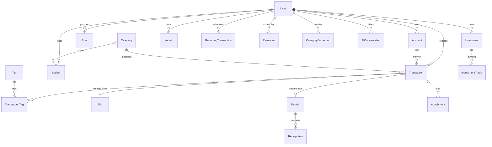

# 02 — Database Design

Authoritative schema: [`apps/backend/prisma/schema.prisma`](../apps/backend/prisma/schema.prisma). This doc explains the *why*.

## 1. Entity map



Plus standalone: `Notification`, `AuditLog`, `WebhookEvent` (dedupe).

## 2. Design decisions

| Decision | Rationale |
|---|---|
| **Money = `Decimal(18,2)`** | No float rounding. 18 digits covers net-worth-level sums. Crypto quantities use `Decimal(28,10)` |
| **`Transaction.shortRef`** per-user incrementing int | Users say `ลบ #52`. Allocated from `User.nextTxnRef` inside the insert transaction — no global sequence contention |
| **Soft delete** (`deletedAt`) on Transaction | Chat-driven deletes need undo; all queries filter `deletedAt: null` (enforced in repository, one place) |
| **Transfers = one row** with `accountId` + `toAccountId` | Simpler than double-entry pair for this product; balance math handled in `TransactionService` within a DB transaction |
| **Account.balance stored, not derived** | O(1) balance reads at chat speed; updated atomically with each transaction insert/update/delete; nightly reconciliation job re-derives and flags drift |
| **Category: system + per-user** | 15 system categories seeded (`userId = null`, Thai+English names); users can add their own; `parentId` supports subcategories |
| **`CategoryCorrection`** (`userId` + normalized keyword → category, hitCount) | "Remember corrections forever": on every parse, corrections are checked **before** rules/AI — the user's own history beats the model |
| **Slip/Receipt separate from Transaction** | OCR result is evidence, not a transaction. Confirm flow links `transactionId` after user answers income/expense. Keeps raw OCR text + confidence for retraining/debugging |
| **`WebhookEvent.eventId` unique** | Hard dedupe guarantee behind the fast Redis check |
| **`RecurringTransaction.nextRunAt` indexed** | Scheduler queries `WHERE isActive AND nextRunAt <= now()` — index scan, no full table walk |
| **`AIConversation`** stores role/content/intent/model/tokens | Short-term memory window for the LLM + cost accounting + behavior learning |
| **AuditLog with before/after JSON** | Compliance-grade trail for every mutation, keyed by entity + entityId |

## 3. Key indexes

```
Transaction: (userId, occurredAt DESC)      ← every summary/search query
             (userId, categoryId, occurredAt), (accountId), (userId, shortRef) UNIQUE
Account:     (userId, name) UNIQUE
Budget:      (userId, categoryId, period) UNIQUE
CategoryCorrection: (userId, keyword) UNIQUE
RecurringTransaction: (isActive, nextRunAt)
Reminder:    (isActive, nextTriggerAt)
WebhookEvent: eventId UNIQUE
User:        lineUserId UNIQUE
```

## 4. Seed data

`prisma/seed.ts` inserts: 15 system categories (Food, Transportation, Shopping, Bills, Health, Education, Travel, Entertainment, Investment, Insurance, Tax, Gift, Salary, Business, Others) with Thai names + emoji icons + type (INCOME/EXPENSE/BOTH), and Thai bank provider presets (SCB, KBank, Krungthai, Bangkok Bank, TrueMoney, ...).

## 5. Migration policy

- `prisma migrate dev` locally, `prisma migrate deploy` in CI/prod.
- Schema changes only via TASK-01 (core owner). Other tasks request changes in their task file's "Schema change requests" section.
