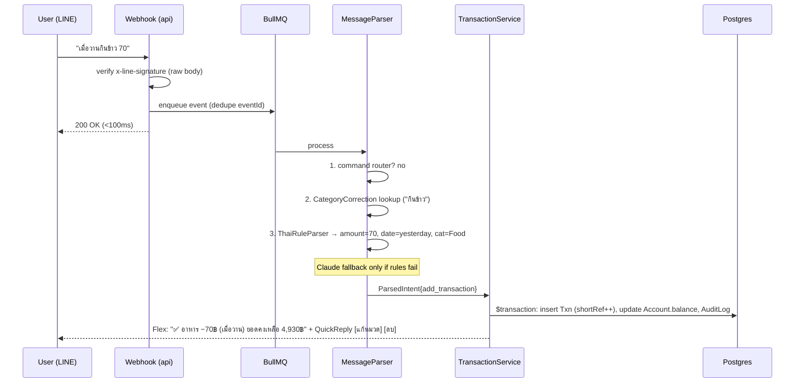
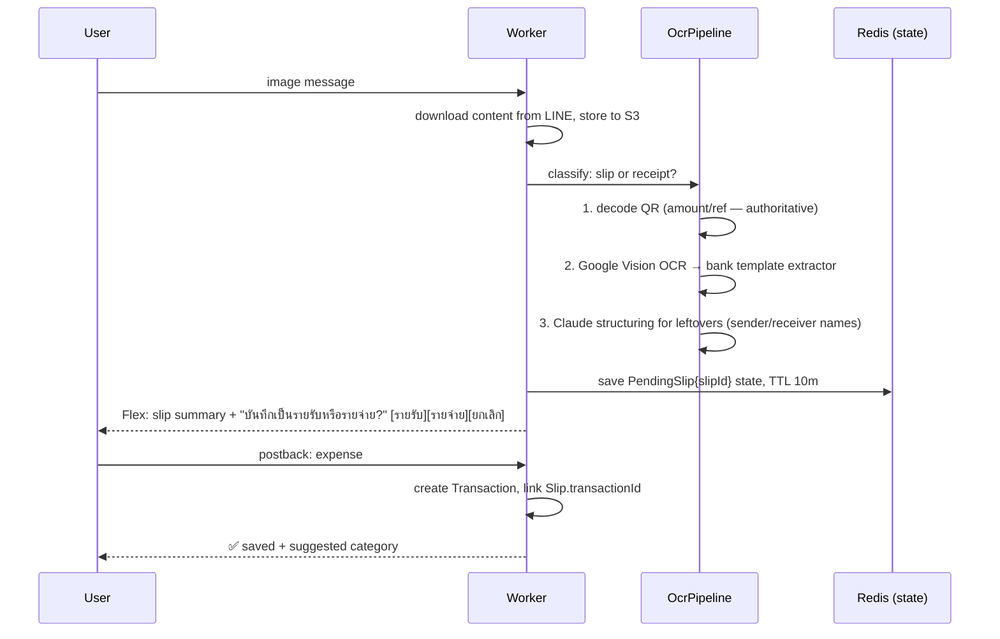

# 03 — Workflows

Sequence diagrams for every major flow. These are normative — implementations must match.

## 1. Text message → transaction



## 2. Slip image → confirmed transaction



Receipt variant: extract store/items/VAT/total → suggest category directly (skip income/expense question — receipts are expenses).

## 3. Delete with confirmation

```
"ลบ #52" → resolve txn by shortRef → Redis pending-confirm state
        → "ลบรายการนี้? [#52 กาแฟ −75฿]" [ยืนยัน][ยกเลิก]
postback ยืนยัน → soft delete + reverse balance + AuditLog → "🗑 ลบแล้ว (พิมพ์ 'กู้คืน #52' ภายใน 24 ชม.)"
```

## 4. Recurring transactions (scheduler)

```
BullMQ repeatable "recurring-scan" every 5 min:
  SELECT * FROM RecurringTransaction WHERE isActive AND nextRunAt <= now()
  for each (idempotency key = recurringId + period):
    create Transaction (source=RECURRING) in $transaction
    advance nextRunAt by frequency
    push LINE notification "📅 บันทึกอัตโนมัติ: Netflix −419฿"
```

## 5. Budget alerts

```
After every expense insert → BudgetService.checkThresholds(userId, categoryId)
  spent = SUM(period) vs Budget.amount → crossed 50/80/100?
  alert level not yet sent this period (Redis key budget:{id}:{period}:{level})
  → push "⚠️ งบอาหารเดือนนี้ใช้ไป 82% (4,100/5,000฿)"
```

## 6. Daily reminder

```
Repeatable job per Reminder (cron in user's timezone, default 20:00 Asia/Bangkok):
  → push "วันนี้มีรายรับรายจ่ายเพิ่มเติมไหม 😊" + QuickReply [สรุปวันนี้][ไม่มี]
```

## 7. Dashboard login

```
Dashboard → LINE Login (OIDC authorize) → callback with code
  → backend exchanges code, verifies id_token → find/create User by lineUserId
  → issue JWT access (15m) + refresh (30d, httpOnly cookie) → dashboard calls REST API
```

## 8. Report export

```
"ขอรายงานเดือนนี้เป็น Excel" | dashboard button
  → enqueue export job → generate xlsx/csv/pdf → upload S3
  → presigned URL (TTL 24h) → send via LINE / dashboard download
```
